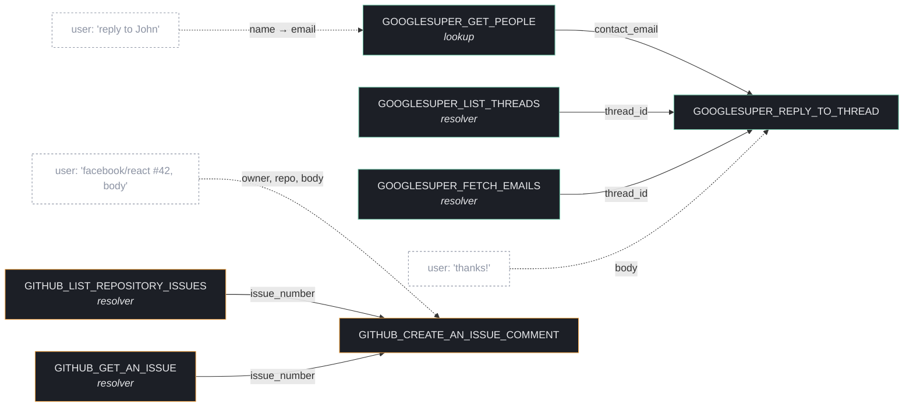

# composio · tool dependency graph

> Submission for the Composio engineering take-home. Builds a typed dependency graph over the **Google Super** and **GitHub** toolkits (1,309 tools, ~5,200 edges) so an agent can answer: *"before I can call tool X, what does it need from another tool, and what does it need from the user?"*

## the 30-second version

Open [`dep-graph.html`](./dep-graph.html) in any browser — double-click works, no server needed, the graph data is inlined. You land on `GITHUB_CREATE_AN_ISSUE_COMMENT` with an execution plan already drawn:

```
1. resolve issue_number  — call GITHUB_LIST_REPOSITORY_ISSUES (conf 1.00)
2. gather from user       — owner, repo, body
3. call CREATE_AN_ISSUE_COMMENT
```

Left sidebar: pick another entity (`thread_id`, `pull_number`, `file_id`, …) or search for a tool. Right sidebar: that tool's prerequisites, what it needs from the user, what it produces, and downstream consumers.

## why this isn't just "graph the schemas"

The naive read of this brief is: walk every input param, for each ID-shaped param find all tools whose output includes the same ID, draw an edge. That gives you 200k edges and zero signal. Three problems with it:

**1. Passthrough tools look like producers.** `GITHUB_LIST_ISSUE_COMMENTS` returns objects containing `issue_number`, so it "produces" it on paper — but it also *requires* an `issue_number` to run. An agent that doesn't already have an issue cannot use this tool to discover one. It's not a resolver; it's passthrough. The fix:

```ts
const isPassthrough =
  producedEntity &&
  // only REQUIRED producer_ref/lookup_required inputs count.
  // an optional `sha` filter on LIST_COMMITS doesn't make it passthrough.
  requiredProducerRefInputs.includes(producedEntity);
```

`LIST_COMMITS` has `sha` as an *optional* filter, so it's still a valid resolver for `sha`. `LIST_ISSUE_COMMENTS` requires `issue_number`, so it's marked passthrough and hidden by default.

**2. Ubiquitous IDs aren't real edges.** Every GitHub list tool returns `owner` and `repo` somewhere. Drawing 200 → N edges per consumer-needing-`owner` drowns the real signal. In practice the agent gets `owner` / `repo` from the user (*"comment on facebook/react"*), not from another tool. So `owner`, `repo`, `org`, `user_login`, `user_id` are flagged as ubiquitous — they show up under "Needs from user" on the consumer node, not as edges.

**3. User-provided fields need to be classified, not connected.** Some params are IDs you fetch (`thread_id` from `LIST_THREADS`). Some are names you look up (`recipient_email` from a contact name → `contacts.search`). Some are content only a human can compose (`body`, `subject`). Treating these the same gives you a flat graph; classifying them gives you something an agent can actually plan with.

The graph has typed edges (producer_consumer, lookup, mentioned) **and** typed quality (resolver, passthrough, mentioned-only). The viz defaults hide passthrough — you can toggle them on if you want to see what got filtered.

## how it was built

Four small Bun scripts, run in sequence. The first three populate `data/`; the fourth bundles the result into a single-file viz.

```sh
COMPOSIO_API_KEY=ak_xxx sh scaffold.sh    # writes .env (composio + openrouter keys)
ANTHROPIC_API_KEY=sk-ant-...              # also needed in .env (extraction model)
bun install
bun run src/fetch-tools.ts                # ~5s   : raw tool schemas → data/tools.*.json
bun run src/extract.ts                    # ~5min : per-tool LLM extraction → data/extracted/*.json
bun run src/build-graph.ts                # <1s   : edges + confidence → data/graph.json
bun run src/inline-viz.ts                 # <1s   : bake graph into dep-graph.html
bun run src/evals.ts                      # <1s   : recall on hand-curated ground truth
```

### phase 2 — extraction (`src/extract.ts`)

One Anthropic call per tool — `claude-haiku-4-5`, concurrency 16. ~5 minutes wall clock, ~$2 total. For each tool we extract a strict JSON object:

```ts
{
  produces: [{ entity: "thread_id", description: "..." }],
  consumes: [{
    param: "thread_id",
    required: true,
    classification: "producer_ref" | "lookup_required" | "user_provided" | "constant_or_default",
    entity: "thread_id" | null,
    rationale: "...",
    mentionedProducers: ["GMAIL_LIST_THREADS"]  // explicit slugs in the description
  }]
}
```

Two choices worth calling out:

- **Why LLM and not regex.** The Composio descriptions are unusually rich — they literally say *"Use GMAIL_LIST_THREADS or GMAIL_FETCH_EMAILS to retrieve valid thread IDs."* The model picks those up as `mentionedProducers` (highest-confidence edges in the graph). Regex can catch the all-caps slug tokens, but it can't decide whether `recipient_email` is "user types an email" vs "user names a person, look it up in contacts" — that's a semantic call. The LLM also normalizes entity names: `pull_number`, `pr_number`, `pullRequestNumber` all collapse to `pull_number`.
- **Why per-tool and not batched.** I tried batching multiple tools per call to save tokens, but error recovery gets painful when one tool in a batch fails to parse and corrupts the others. Per-tool keeps it simple, resumable (the script skips slugs that already have a `data/extracted/*.json`), and the cost difference is small (~$2 vs ~$0.50).

First-pass failure rate was 7/1,309 (~0.5%, mostly tools with huge output schemas hitting the 2k-token cap). Bumped `max_tokens` to 4k and re-ran just the failures — clean.

### phase 3 — edge resolver (`src/build-graph.ts`)

This is the file where most of the actual judgment lives.

For each consumer's input param classified as `producer_ref` or `lookup_required`, we look up every tool that produces the matching canonical entity, score each candidate, and keep the top 6 per `(consumer, entity)` pair. The scoring stack:

| factor | adjustment |
|---|---|
| base | 0.50 |
| same toolkit (gmail-talks-to-gmail) | +0.15 |
| producer is a list/search tool, consumer is `producer_ref` | +0.15 |
| producer is a get tool | +0.10 |
| producer is an update/delete tool (unlikely upstream) | −0.20 |
| producer is a list tool, consumer is `lookup_required` | +0.20 |
| name-stem match (`LIST_COMMITS` ↔ `sha`) | +0.20 |
| **passthrough penalty** (producer also *requires* this entity) | **−0.35** |
| explicit slug mention in description | floor 1.00 |

Three rules carry their weight:

- **Name-stem match.** Without this, ties at the same confidence were broken alphabetically — for `sha` the top resolver was `LIST_BRANCHES` instead of `LIST_COMMITS`. The stem table (`sha ↔ "commit"`, `thread_id ↔ "thread"`, etc.) is small and explicit in code.
- **Passthrough detection.** A tool that requires `X` as a `required` input can't help an agent discover `X` from scratch. Detector checks `required: true` only — optional filters don't make a tool passthrough. Passthrough edges still exist in `data/graph.json` (marked `subtype: "passthrough"`), but they're penalized and hidden in the viz.
- **Ubiquitous entities.** `owner`, `repo`, `org`, `user_login`, `user_id` skip the producer-consumer edge step entirely and surface as "Needs from user" on the consumer node. Single biggest noise reducer: without it the graph has ~9.6k edges, with it ~5.2k useful ones.

### phase 5 — evals (`src/evals.ts`)

Eight hand-curated dependency claims I'd expect any honest agent-planning graph to find. Examples:

- `REPLY_TO_THREAD` should have one of `{LIST_THREADS, FETCH_EMAILS, FETCH_MESSAGE_BY_THREAD_ID, LIST_MESSAGES}` upstream for `thread_id`.
- `CREATE_AN_ISSUE_COMMENT` should have one of `{LIST_REPOSITORY_ISSUES, GET_AN_ISSUE, ...}` upstream for `issue_number`, **and** should flag `body` / `repo` / `owner` as user input.
- `GET_A_COMMIT` should have `LIST_COMMITS` upstream for `sha` — this is the case that breaks if passthrough detection is broken.

Current numbers: **producer-group recall 9/9 (100%), user-input recall 7/12 (58%)**.

The eval is intentionally strict. The 100% producer recall only matters because of the passthrough fix — earlier versions also hit 100% by surfacing `LIST_ISSUE_COMMENTS` as a "producer" of `issue_number`, which was technically true but useless to an agent. The user-input gaps are mostly cases where my eval expected a param like `subject` to be required, but the Composio schema marks it optional — so the graph correctly didn't flag it. I left those visible rather than soften the eval, because the goal here is dependency quality, not benchmark-inflation.

## a small slice of the graph (mermaid)

For reviewers skimming on GitHub without opening the HTML — this is the dependency plan for two of the flows the brief calls out:



Solid arrows are tool → tool dependencies (entity passed along the edge). Dashed arrows are inputs the user/agent supplies directly. The HTML viz lets you click any tool and get the same picture for it.

## file guide

```
src/
  fetch-tools.ts     fetch raw schemas for googlesuper + github
  extract.ts         per-tool LLM extraction (anthropic SDK, claude-haiku-4-5)
  build-graph.ts     edge resolver: scoring, passthrough detection, top-K cap
  inline-viz.ts      inlines data/graph.json into dep-graph.html (single-file output)
  evals.ts           hand-curated ground truth + recall
data/
  tools.summary.json   counts only; raw dumps are gitignored (regenerable via fetch-tools)
  graph.json           final artifact — nodes + typed edges + confidence
  graph.summary.json   stats: edges by type, by subtype, top entities, orphan count
dep-graph.html       single-file interactive viz (~3.8 MB, data inlined for file:// use)
scaffold.sh          (fixed) — the shipped version was missing the x-composio-api-key header
upload.sh            unchanged
```

## what i'd do with more time

- **Multi-entity plans.** Right now the plan picks the top-1 resolver per entity. A real agent would notice that `LIST_THREADS` returns both `thread_id` *and* `message_id`, so it's cheaper than two separate calls. That's a small graph-search on top of what's here.
- **Cluster layout.** Even with passthrough hidden, the graph has obvious clusters (Gmail, Calendar, Drive, Sheets, Issues, PRs, Actions). Grouping nodes by entity-family would make each toolkit's dependency shape readable at a glance.
- **More evals.** 8 cases is enough to catch resolver regressions, not enough to be confident across all 1,309 tools. Next step: have the LLM propose ground-truth pairs for a sample of consumers, hand-verify a slice, expand to ~100 cases.
- **Entity normalization is hand-curated.** The synonym table in `build-graph.ts` is mine. A short LLM pass over the produced entity vocabulary would catch collapses I missed.

## honest caveats

- The graph reflects **what the LLM said about each tool's description**, not ground truth from running the tools. A tool whose description fails to mention that it returns IDs (rare, but it happens) won't show up as a producer.
- For `lookup_required` edges (e.g. recipient email → contacts), I bias toward Google contacts tools. GitHub has its own contact-shaped surface (team members, org users) that could resolve emails in some workflows — those aren't currently linked.
- Confidence numbers are calibrated by intuition + the small eval set, not by a held-out test. They're directionally right (resolver > passthrough, name-match > generic) but the 0.85 default is a knob, not a law.

---

**original brief preserved below for reference:**

> we care about the quality and structure of the dependency relationships you discover.
> some actions need precursor actions before being able to execute them.
> e.g. `GMAIL_REPLY_TO_THREAD` needs a `thread_id` — which can be got from `GMAIL_LIST_THREADS`.
> when we agentically execute actions inside composio, we need to know either what info to get from the user or what other action we should take before we execute the action.
> scoped to **Google Super** and **GitHub** toolkits.
